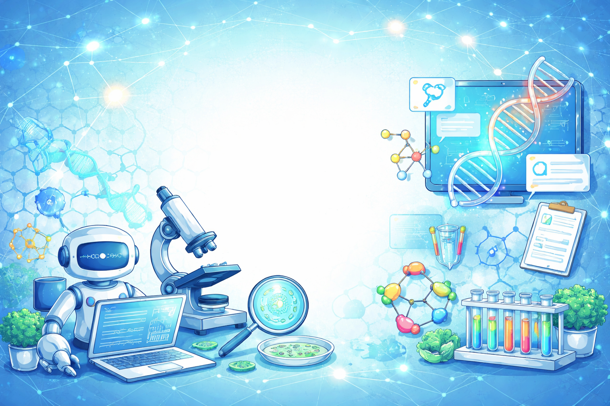

# Awesome Biology Agents, Benchmarks, and Reviews

A curated list of papers on **LLM-based agents in biology and medicine**, organized by **research domain** and then by **timeline**.

This list focuses on three major categories:

- **Agents**: LLM or multi-agent systems applied to biology, biomedicine, bioinformatics, chemistry, and healthcare workflows
- **Benchmarks**: evaluation datasets and benchmarks for biological/biomedical agents or reasoning systems
- **Reviews**: surveys, perspectives, and commentaries on LLMs and agentic AI in biology, medicine, and healthcare

## Contributing 

This repository will be **maintained over the long term** and continuously updated as new work on **LLM-based agents, benchmarks, and reviews in biology and medicine** becomes available.

We warmly welcome contributions from the community, including:

- newly published papers
- benchmarks and datasets
- survey and review articles
- missing links, metadata, or categorization fixes
- suggestions for improving the organization of this collection

If you would like to contribute, please feel free to **open an issue** or **submit a pull request**.

Our goal is to build a **useful, accurate, and up-to-date resource** for researchers working on biological and biomedical agents.

---

## Contents 🤖

- [1. Agents](#1-agents)
  - [1.1 Bioinformatics and Omics Analysis Agents](#11-bioinformatics-and-omics-analysis-agents)
  - [1.2 Single-Cell and Transcriptomics Agents](#12-single-cell-and-transcriptomics-agents)
  - [1.3 Molecular, Protein, RNA, and Gene-Editing Agents](#13-molecular-protein-rna-and-gene-editing-agents)
  - [1.4 Chemistry, Drug Discovery, and Materials Agents](#14-chemistry-drug-discovery-and-materials-agents)
  - [1.5 Clinical, Medical, and Hospital Agents](#15-clinical-medical-and-hospital-agents)
  - [1.6 Imaging, Pathology, and Bioimage Agents](#16-imaging-pathology-and-bioimage-agents)
  - [1.7 General Scientific Discovery and Research Automation Agents](#17-general-scientific-discovery-and-research-automation-agents)
- [2. Benchmarks](#2-benchmarks)
  - [2.1 Bioinformatics and Omics Benchmarks](#21-bioinformatics-and-omics-benchmarks)
  - [2.2 Biological Reasoning and Multimodal Scientific Benchmarks](#22-biological-reasoning-and-multimodal-scientific-benchmarks)
- [3. Reviews and Perspectives](#3-reviews-and-perspectives)
  - [3.1 General Healthcare and Medical LLM Reviews](#31-general-healthcare-and-medical-llm-reviews)
  - [3.2 Biology, Bioinformatics, and Biomedical Discovery Reviews](#32-biology-bioinformatics-and-biomedical-discovery-reviews)
  - [3.3 Agents in Medicine, Oncology, Chemistry, and Scientific Discovery](#33-agents-in-medicine-oncology-chemistry-and-scientific-discovery)
 - [4. Related RNA Resources](#4-Related RNA Resources)

---

# 1. Agents

## 1.1 Bioinformatics and Omics Analysis Agents

LLM-based or multi-agent systems that automate bioinformatics pipelines, omics workflows, and downstream biological interpretation.

### Timeline

- **[2024.06 | Preprint]** **BioInformatics Agent (BIA): Unleashing the Power of Large Language Models to Reshape Bioinformatics Workflow**
- **[2024.11 | Advanced Science]** **An AI Agent for Fully Automated Multi-Omic Analyses**
- **[2025.01 | Preprint]** **BioAgents: Democratizing Bioinformatics Analysis with Multi-Agent Systems**
- **[2025.01 | Preprint]** **BioMaster: Multi-agent System for Automated Bioinformatics Analysis Workflow**
- **[2025.03 | Preprint]** **FlowAgent: A Modular Agent-Based System for Automated Workflow Management and Data Interpretation**
- **[2025.03 | Preprint]** **IAN: An Intelligent System for Omics Data Analysis and Discovery**

### Notes

This group is closest to the vision of a **bioinformatics copilot**: data loading, preprocessing, statistical analysis, pathway analysis, visualization, and interpretation through agent orchestration.

---

## 1.2 Single-Cell and Transcriptomics Agents

Agent systems focused on single-cell RNA-seq, transcriptomics exploration, or natural-language interfaces to cellular data.

### Timeline

- **[2024.06 | Preprint]** **CellAgent: An LLM-driven Multi-Agent Framework for Automated Single-cell Data Analysis**
- **[2024.10 | Preprint]** **Multimodal learning of transcriptomes and text enables interactive single-cell RNA-seq data exploration with natural-language chats**
- **[2025.01 | Preprint]** **A Multi-Modal AI Copilot for Single-Cell Analysis with Instruction Following**
- **[2025.02 | Preprint]** **scBaseCamp: an AI agent-curated, uniformly processed, and continually expanding single cell data repository**
- **[2025.03 | Preprint]** **CompBioAgent: An LLM-powered agent for single-cell RNA-seq data exploration**
- **[2025.07 | Preprint]** **GenoMAS: A Multi-Agent Framework for Scientific Discovery via Code-Driven Gene Expression Analysis** `[code] [website]`

### Notes

These works represent an important trend: moving from static single-cell pipelines toward **interactive, instruction-following, and agent-mediated transcriptomics analysis**.

---

## 1.3 Molecular, Protein, RNA, and Gene-Editing Agents

Agentic systems for protein engineering, RNA understanding, genetic perturbation, or automated design of gene-editing experiments.

### Timeline

- **[2023.11 | Preprint]** **Validation of an LLM-based Multi-Agent Framework for Protein Engineering in Dry Lab and Wet Lab**
- **[2024.03 | Preprint]** **BioDiscoveryAgent: An AI Agent for Designing Genetic Perturbation Experiments**
- **[2024.04 | Preprint]** **CRISPR-GPT: An LLM Agent for Automated Design of Gene-Editing Experiments**
- **[2024.11 | Preprint]** **The Virtual Lab: AI Agents Design New SARS-CoV-2 Nanobodies with Experimental Validation**

### Notes

This domain is especially important for **design-oriented scientific agents**:
- perturbation planning
- CRISPR experiment design
- protein/RNA sequence-level reasoning
- dry-lab to wet-lab loop closure

---

## 1.4 Chemistry, Drug Discovery, and Materials Agents

Agent systems applied to chemical synthesis, drug discovery, molecular design, and materials science.

### Timeline

- **[2023.12 | Nature]** **Autonomous chemical research with large language models**
- **[2024.03 | Advanced Science]** **BioinspiredLLM: Conversational Large Language Model for the Mechanics of Biological and Bio-Inspired Materials**
- **[2024.05 | Nature Machine Intelligence]** **Augmenting large language models with chemistry tools**
- **[2024.11 | Preprint]** **DrugAgent: Automating AI-aided Drug Discovery Programming through LLM Multi-Agent Collaboration**
- **[2024.12 | Advanced Materials]** **SciAgents: Automating Scientific Discovery Through Bioinspired Multi-Agent Intelligent Graph Reasoning**
- **[2025.03 | Preprint]** **PharmAgents: Building a Virtual Pharma with Large Language Model Agents**

### Notes

This cluster is important because chemistry and drug discovery were among the earliest areas where **tool-using scientific agents** showed clear practical value.

---

## 1.5 Clinical, Medical, and Hospital Agents

Agent systems for diagnosis, clinical reasoning, medical workflow simulation, multimodal medical tooling, and outpatient or hospital scenarios.

### Timeline

- **[2024.05 | Preprint]** **Agent Hospital: A Simulacrum of Hospital with Evolvable Medical Agents**
- **[2024.06 | Preprint]** **MedAgents: Large Language Models as Collaborators for Zero-shot Medical Reasoning**
- **[2024.10 | Preprint]** **MMedAgent: Learning to Use Medical Tools with Multi-modal Agent**
- **[2024.11 | Preprint]** **PIORS: Personalized Intelligent Outpatient Reception based on Large Language Model with Multi-Agents Medical Scenario Simulation**
- **[2024.12 | Preprint]** **AI-HOPE: An AI-Driven conversational agent for enhanced clinical and genomic data integration in precision medicine research**
- **[2025.01 | Preprint]** **KG4Diagnosis: A Hierarchical Multi-Agent LLM Framework with Knowledge Graph Enhancement for Medical Diagnosis**
- **[2025.03 | Preprint]** **TxAgent: An AI Agent for Therapeutic Reasoning Across a Universe of Tools**

### Notes

This category spans:
- medical reasoning
- diagnosis support
- hospital simulation
- therapeutic decision-making
- multimodal tool use in healthcare

---

## 1.6 Imaging, Pathology, and Bioimage Agents

Agent or copilot systems for pathology, computational bioimaging, and image-driven biological analysis.

### Timeline

- **[2024.06 | Nature]** **A multimodal generative AI copilot for human pathology**
- **[2024.06 | Nature Methods]** **Omega — harnessing the power of large language models for bioimage analysis**
- **[2024.08 | Nature Methods]** **BioImage.IO Chatbot: a community-driven AI assistant for integrative computational bioimaging**

### Notes

These works highlight a major trend toward **multimodal scientific copilots**, where image understanding is combined with conversational analysis and tool-assisted workflows.

---

## 1.7 General Scientific Discovery and Research Automation Agents

Papers that target broader scientific automation, autonomous research, or AI research assistants beyond a single biological subdomain.

### Timeline

- **[2023.12 | Preprint]** **Leveraging large language models for data analysis automation**
- **[2024.04 | Preprint]** **Replicating a High-Impact Scientific Publication Using Systems of Large Language Models**
- **[2025.01 | Preprint]** **Agent Laboratory: Using LLM Agents as Research Assistants**
- **[2025.02 | Preprint]** **Towards an AI co-scientist**
- **[2025.02 | Preprint]** **Spike sorting AI agent**

### Notes

These papers are useful if you are interested in:
- autonomous scientific reasoning
- experiment planning
- code-driven research support
- agentic scientific infrastructure

---

# 2. Benchmarks

## 2.1 Bioinformatics and Omics Benchmarks

Benchmarks specifically designed for biological data analysis workflows or agent-based bioinformatics.

### Timeline

- **[2024.06 | MLCB 2025 Oral]** **GenoTEX: An LLM Agent Benchmark for Automated Gene Expression Data Analysis** `[code] [website]`
- **[2025.03 | Preprint]** **BixBench: a Comprehensive Benchmark for LLM-based Agents in Computational Biology**

### Notes

These are especially important for evaluating:
- automated gene expression analysis
- pipeline orchestration
- computational biology agent capabilities

---

## 2.2 Biological Reasoning and Multimodal Scientific Benchmarks

Benchmarks for biological pathway reasoning, microscopy reasoning, and multimodal scientific problem solving.

### Timeline

- **[2025.03 | Preprint]** **BioMaze: Benchmarking and Enhancing Large Language Models for Biological Pathway Reasoning**
- **[2025.03 | Preprint]** **MicroVQA: A Multimodal Reasoning Benchmark for Microscopy-Based Scientific Research**

### Notes

This group is useful if your interest is not only workflow automation, but also:
- biological reasoning
- pathway understanding
- multimodal scientific question answering

---

# 3. Reviews and Perspectives

## 3.1 General Healthcare and Medical LLM Reviews

Surveys and reviews focused broadly on LLMs in medicine and healthcare.

### Timeline

- **[2023.05 | Arquivos Brasileiros de Cirurgia Digestiva]** **Future of the Language Models in Healthcare: The Role of ChatGPT**
- **[2023.07 | Lancet]** **The promise of large language models in health care**
- **[2023.11 | Preprint]** **A Survey of Large Language Models in Medicine: Progress, Application, and Challenge**
- **[2024.05 | iScience]** **The application of large language models in medicine: A scoping review**
- **[2024.07 | arXiv]** **Large Language Models in Healthcare and Medical Domain: A Review**
- **[2024.11 | PLOS Digital Health]** **Large language models in medicine: A review of current clinical trials across healthcare applications**
- **[2024.12 | Springer]** **Large language models in medical and healthcare fields: applications, advances, and challenges**
- **[2024.09 | Artificial Intelligence Review]** **Large language models in medical and healthcare fields: applications, advances, and challenges**
- **[2025.02 | The Lancet]** **The rise of agentic AI teammates in medicine**

### Notes

A good starting point for readers entering the field from medicine or digital health.

---

## 3.2 Biology, Bioinformatics, and Biomedical Discovery Reviews

Reviews focused on biology, bioinformatics, genomics, and broader biomedical discovery.

### Timeline

- **[2024.06 | Preprint]** **Bioinformatics and Biomedical Informatics with ChatGPT: Year One Review**
- **[2024.07 | Preprint]** **Empowering Biomedical Discovery with AI Agents**
- **[2024.08 | Springer Link]** **Large models for genomics**
- **[2024.10 | Cell]** **Empowering biomedical discovery with AI agents**
- **[2024.12 | Computational and Structural Biotechnology Journal]** **Large language models and their applications in bioinformatics**
- **[2025.03 | Trends in Biotechnology]** **Large language model for knowledge synthesis and AI-enhanced biomanufacturing**

### Notes

Recommended for readers working on:
- computational biology
- genomics foundation models
- biological discovery systems
- AI-assisted scientific hypothesis generation

---

## 3.3 Agents in Medicine, Oncology, Chemistry, and Scientific Discovery

Reviews or perspective pieces specifically focused on agentic systems and domain-specific transformation.

### Timeline

- **[2024.04 | npj Digital Medicine]** **Evaluating large language models as agents in the clinic**
- **[2024.07 | Nature Medicine]** **Evaluating the clinical benefits of LLMs**
- **[2024.10 | JCO Precision Oncology]** **Expert-Guided Large Language Models for Clinical Decision Support in Precision Oncology**
- **[2024.11 | Preprint]** **A Review of Large Language Models and Autonomous Agents in Chemistry**
- **[2024.12 | Nature Machine Intelligence]** **LLM-based agentic systems in medicine and healthcare**
- **[2024.12 | Nature Cancer]** **How AI agents will change cancer research and oncology**
- **[2024.05 | PMC]** **Clinical and Surgical Applications of Large Language Models: A Systematic Review**

### Notes

This section is most relevant if your interest is:
- agentic AI in clinical environments
- oncology and precision medicine
- chemistry and autonomous experimentation
- evaluation of medical agents

---

## 4. Related RNA Resources

If you work on **RNA biology**, **RNA language models**, or **RNA-centric foundation models**, you may also find the following resources useful.

#### 🕵🏻‍♀️ RNA-Scope: Benchmarking RNA Language Models for RNA Sequence Understanding

**Venue:** [NeurIPS 2025 AI for Science Workshop](https://openreview.net/forum?id=lnV3NXpDiC#discussion)  

**RNA-Scope** is a benchmark for evaluating RNA language models on RNA sequence understanding.  
To the best of our knowledge, it is currently the **largest RNA benchmark dataset**, covering diverse RNA-related tasks and providing a systematic evaluation framework for RNA representation learning.

#### 🧬 Decoding the RNA interactome by UltraGen

**Preprint:** https://europepmc.org/article/ppr/ppr878242,  *UndeReview*

We introduce **UltraGen**, an RNA language model designed to capture **RNA binding properties**. To the best of our knowledge, UltraGen is the **first language model pretrained on in vitro synthesized RNA**.  Through fine-grained self-learning, UltraGen identifies RNA aptamers across a wide spectrum of targets, including: small molecules, proteins and multi(cellular) molecules. It also supports broader RNA biology applications, including: tissue-specificity recognition for millions of RNA species across **22 human organs** using **3'-UTR sequences**, prediction of the tropism of **human-pathogenic RNA viruses** and characterization of **SARS-CoV-2 replicase RNA binding** at **single-base resolution**.

